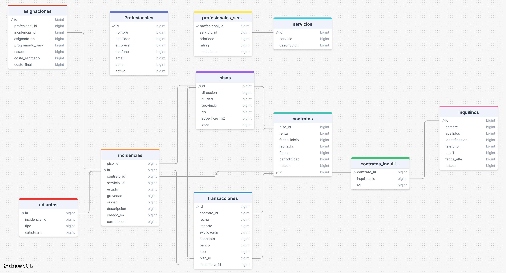

# CS50 SQL Final Project — Property Management Database  
**By Carles Gregori Grau**

This project is my final submission for **CS50’s Introduction to Databases with SQL**.  
It implements a complete **relational database system for property management**, focused on rental apartments, tenants, maintenance incidents, professionals, contracts, and financial transactions.

The goal is to provide a unified, consistent, and query-friendly data model that allows a property manager to track:

- which apartments are being rented  
- which tenants are associated with each contract  
- what maintenance incidents occur  
- which professionals handle them  
- and all financial movements resulting from rent payments and incident-related expenses  

---

## 📹 Video Overview  
A full walkthrough of the project can be found here:  
👉 **https://youtu.be/AXeSFTyFSzw**

---

## 🧠 Project Summary

This database centralizes all core operations of rental property management.  
It supports:

- registering apartments  
- managing contracts and multiple tenants per contract  
- linking incidents to apartments, services, professionals, and costs  
- recording financial transactions for both rental income and incident expenses  
- producing summary views such as profitability, tenant payments, costs per incident, and balance per apartment  

The schema uses **foreign keys, CHECK constraints, composite keys, and views**, and it is fully normalized.

---

## 🗂️ Files Included

| File | Description |
|------|-------------|
| **schema.sql** | Full SQL DDL defining tables, constraints, relationships, indexes, and views. |
| **queries.sql** | Analytical queries for reports (open incidents, ratings, tenant totals, etc.). |
| **DESIGN.md** | Detailed design document describing scope, functional requirements, entities and relationships, optimizations, and limitations. |
| **inmobiliaria.db** | SQLite database (optional, for demonstration and testing). |
| **ERD.png** | Entity-Relationship Diagram of the entire schema. |

---

## 🧱 Database Schema Overview

The database is structured around nine core entities and several many-to-many relationships.

### **Main Entities**
- **pisos** — apartments in the rental portfolio  
- **inquilinos** — tenants  
- **contratos** — rental contracts  
- **contratos_inquilinos** — many-to-many link between contracts and tenants  
- **servicios** — catalog of maintenance services  
- **profesionales** — external professionals or companies  
- **profesionales_servicios** — service capabilities per professional  
- **incidencias** — maintenance incidents  
- **asignaciones** — assignments of professionals to incidents  
- **adjuntos** — attachments linked to incidents  
- **transacciones** — financial movements (rent, expenses, etc.)

### **ER Diagram**



---

## 🧩 Key Features

### ✔ Fully normalized relational model  
All relationships between tenants, contracts, properties, incidents, and transactions are expressed using foreign keys and composite keys.

### ✔ Business rules encoded into the schema  
Examples include:

- tenants and professionals with valid emails  
- allowed states for contracts and incidents  
- valid date ordering (e.g., contract end date must be after start date)  
- transactions must belong to **exactly one** of: contract, apartment, or incident (`CHECK` constraint)

### ✔ Analytical Views  
Views expose higher-level business logic without requiring application code:

- **consulta_incidencias** → incident summary with total cost  
- **rentabilidad_piso** → rental income per apartment  
- **inquilinos_info** → total paid by each tenant per contract  
- **balance_piso** → combined income, expenses, and net balance per apartment  

These allow managers to obtain insights with a single query.

### ✔ Indexes for performance  
Based on access patterns and join frequency:

- `transacciones_idx` on `incidencia_id`  
- `inquilinos_ci_idx` on `inquilino_id`  
- `inquilinos_t_idx` on `contrato_id`  

---

## 📊 Example Queries (from `queries.sql`)

The project includes a set of practical reporting queries, such as:

- **Open incidents ordered by severity and date**  
- **Total cost per incident**  
- **Average rating and hourly cost per professional**  
- **Total rent paid per tenant**  
- **Apartments without open incidents**  

These showcase how the schema supports real-world operational questions.

---

## 🛠️ How to Run

1. Install SQLite 3  
2. Load the schema:

```bash
sqlite3 inmobiliaria.db < schema.sql
